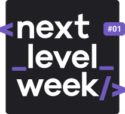

#### NextLevelWeek 1.0 🚀

[Next Level Week](#-nlw)
|
[Project](#-project)
|
[Technologies](#rocket-Technologies)
|
[How to use](#-how-to-use)
|
[License](#memo-license)

##  Next Level Week

NLW is a study week event taught by Rocketseat. 
In this event is approached the best technologies to help devs to go to next level in their careers.

## 💻 Project

Ecoleta is a project created with the purpose to connect people to companies whoe collects specific wate such as light bulbs, batteries, cooking oil and others. This project was reproduced following the NLW with studie purposes.

## 📦 Technologies

This project was developed with the following technologies:

- [Node.js][nodejs]
- [TypeScript][typescript]
- [React][reactjs]
- [React Native][rn]
- [Expo][expo]

## ℹ️ How To Use

To clone and run this application, you'll need [Git](https://git-scm.com), [Node.js][nodejs] + [Yarn][yarn] installed on your computer.

From your command line:

### Install API

```bash
# Clone this repository
$ git clone https://github.com/andreciornavei/NLW-1.0-ecoleta

# Go into the repository
$ cd NLW-1.0/backend

# Install dependencies
$ yarn install

# Run Migrates
$ yarn knex:migrate

# Run Seeds
$ yarn knex:seed

# Start server
$ yarn dev

# running on port 3333
```

### Install Front-end

```bash
# Clone this repository
$ git clone https://github.com/andreciornavei/NLW-1.0-ecoleta

# Go into the repository
$ cd NLW-1.0-ecoleta/frontent

# Install dependencies
$ yarn install

# Run
$ yarn start

# running on port 3000
```

### Install Mobile

```bash
# Clone this repository
$ git clone https://github.com/andreciornavei/NLW-1.0-ecoleta

# Go into the repository
$ cd NLW-1.0/mobile

# Install dependencies
$ yarn install

# Run
$ yarn start

# Expo will open, just scan the qrcode on terminal or expo page

# If some problem with fonts, execute:
$ expo install expo-font @expo-google-fonts/ubuntu @expo-google-fonts/roboto

```

## 📜 License

This project is under the MIT license. See the [LICENSE](https://github.com/andreciornavei/NLW-1.0-ecoleta/blob/master/LICENSE) for details.

Reproduced by André Ciornavei - [Get in touch!](https://www.linkedin.com/in/andreciornavei/)

[nodejs]: https://nodejs.org/
[typescript]: https://www.typescriptlang.org/
[expo]: https://expo.io/
[reactjs]: https://reactjs.org
[rn]: https://facebook.github.io/react-native/
[yarn]: https://yarnpkg.com/
[vs]: https://code.visualstudio.com/
[vceditconfig]: https://marketplace.visualstudio.com/items?itemName=EditorConfig.EditorConfig
[vceslint]: https://marketplace.visualstudio.com/items?itemName=dbaeumer.vscode-eslint
[prettier]: https://marketplace.visualstudio.com/items?itemName=esbenp.prettier-vscode
